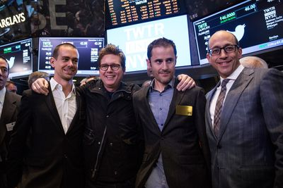
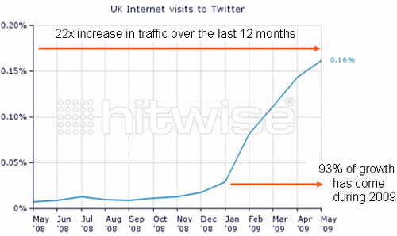

# Twitter
## About
>Twitter (/ˈtwɪtər/) is a microblogging and social networking service on which users post and interact with messages known as "tweets". Tweets were originally restricted to 140 characters, but on November 7, 2017, this limit was doubled to 280 for all languages except Chinese, Japanese, and Korean. Registered users can do the following.
* post 
* like 
* retweet 
* tweets 
>but unregistered users can only read them. Users access Twitter through its website interface, through Short Message Service (SMS) or its mobile-device application software ("app"). Twitter, Inc. is based in San Francisco, California, and has more than 25 offices around the world.

>
## Creation
>Twitter was created in March 2006 in July of that year by four persons namely 

1.Jack Dorsey

2.Noah Glass

3.Biz Stone

4.Evan Williams

>The service rapidly gained worldwide popularity. In 2012, more than 100 million users posted 340 million tweets a day, and the service handled an average of 1.6 billion search queries per day. In 2013, it was one of the ten most-visited websites and has been described as "the SMS of the Internet". As of 2018, Twitter had more than 321 million monthly active users. Since 2015 Twitter has been a hotbed of debates and news covering politics of the United States. During the 2016 U.S. presidential election, Twitter was the largest source of breaking news on the day, with 40 million election-related tweets sent by 10:00 p.m. (Eastern Time) that day.

>
## Growth
>The company experienced rapid initial growth. It had 400,000 tweets posted per quarter in 2007. This grew to 100 million tweets posted per quarter in 2008. In February 2010, Twitter users were sending 50 million tweets per day. By March 2010, the company recorded over 70,000 registered applications. As of June 2010, about 65 million tweets were posted each day, equaling about 750 tweets sent each second, according to Twitter. As of March 2011, that was about 140 million tweets posted daily. As noted on Compete.com, Twitter moved up to the third-highest-ranking social networking site in January 2009 from its previous rank of twenty-second.

>

## References

* https://en.wikipedia.org/wiki/Twitter
* https://wearesocial.com/uk/blog/2009/06/twitters-rise-decline-blogs
* https://www.theverge.com/2015/10/5/9457277/jack-dorsey-twitter-ceo-timeline
* https://www.google.com/search?q=twitter&rlz=1C1GCEB_enUS863US863&source=lnms&tbm=isch&sa=X&ved=0ahUKEwjY487dh6HkAhUQiqwKHQ_jDZwQ_AUIEigC&biw=1366&bih=576#imgrc=dlo3Dy_bAshtRM:

