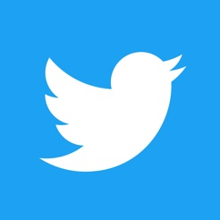

# Twitter
## about
>Twitter (/ˈtwɪtər/) is a microblogging and social networking service on which users post and interact with messages known as "tweets". Tweets were originally restricted to 140 characters, but on November 7, 2017, this limit was doubled to 280 for all languages except Chinese, Japanese, and Korean. Registered users can do the following
* post 
* like 
* retweet 
* tweets 
>but unregistered users can only read them. Users access Twitter through its website interface, through Short Message Service (SMS) or its mobile-device application software ("app"). Twitter, Inc. is based in San Francisco, California, and has more than 25 offices around the world.

>
## Creation and initial reaction
>Twitter was created in March 2006 in July of that year by four persons namely 

1.Jack Dorsey
2.Noah Glass
3.Biz Stone
4.Evan Williams

>The service rapidly gained worldwide popularity. In 2012, more than 100 million users posted 340 million tweets a day, and the service handled an average of 1.6 billion search queries per day. In 2013, it was one of the ten most-visited websites and has been described as "the SMS of the Internet". As of 2018, Twitter had more than 321 million monthly active users. Since 2015 Twitter has been a hotbed of debates and news covering politics of the United States. During the 2016 U.S. presidential election, Twitter was the largest source of breaking news on the day, with 40 million election-related tweets sent by 10:00 p.m. (Eastern Time) that day.

